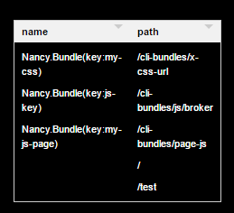

# This project is no longer maintained.
___
# Nancy.Bundle

### This project uses the NancyFx wiki bundle and minification example as inspiration. See websampleapp.

### Of course using the Nancy way.

#### Click for [SourceBrowser](http://sourcebrowser.io/Browse/leonibr/Nancy.Bundle.git/)

#### Now get all route keys in Nancy Diagnostics



1. `Install-Package Nancy.Bundle`

1. You must create a ConfigSettings class that inherits from `DefaultConfigSettings`. Only one for project.

    ```c#
    using Nancy.Bundle.Settings;

    public class MyBundleConfig : DefaultConfigSettings
    {
            //optional override
        public override string CommonAssetsRoute
        {
            get {
                    //The default route is '/assets' now changing to '/cli-bundles'
                return "/cli-bundles";
            }
        }
    }
    ```

1. Now create your bundles:

    ```c#
    public class MyJsBundle : JSFiles
    {

        public override List<IContentItem> Contents()
        {
            return new List<IContentItem>() {  //order is important
                new ContentFile("~/content/lib/jquery-3.0.0.js", eMinify.DoNotMinifyIt),
                new ContentFolder("~/content/app",eRecursive.ThisFolderAndChildrenFolders, eMinify.MinifyIt)
            };
        }

        public override string ReleaseKey()
        {
            return "public-js";
        }

        public override string ReleaseUrl()
        {
            return "/js";
            //this will result `<your-host>/cli-bundles/js` route for js
        }
    }
    ```

    #### Create a bundle using a existing one as a base bundle.

    ```c#
    public class PageStyle : MyJsBundle
    {

        public override List<IContentItem> Contents()
        {
            var contents = base.Contents();
            contents.Add(new ContentFile("~/content/test/test.js", eMinify.MinifyIt));
            return contents;
        }

        public override string ReleaseKey()
        {
        //If not overrided it will throw an exception for duplicate key. Because the `MyJsBundle.ReleaseKey` is aleready stored.
            return "my-js-page";
        }

        public override string ReleaseUrl()
        {
            return "/page-js";
        }
    }
    ```

    ```c#
    public class MyCssBundle : CSSFiles
    {
        public override List<IContentItem> Contents()
        {
            return new List<IContentItem>() {  //order is important
                new ContentFile("~/css/style2.css", eMinify.MinifyIt),
                new ContentFile("~/css/style1.css", eMinify.MinifyIt)
            };
        }

        public override string ReleaseKey()
        {
            return "public-css";
        }

        public override string ReleaseUrl()
        {
            return "/public/css";
            //this will result `<your-host>/cli-bundles/public/css` route for css
        }
    }
    ```

1. Enable `AttachNancyBundle` to your applications bootstrapper class

    ```c#
    using Nancy.Bundle;
    // ...
    protected override void ApplicationStartup(TinyIoCContainer container, IPipelines pipelines)
    {
    //Preferrable in ApplicationStartup
        container.AttachNancyBundle<MyBundleConfig>
        (cfg =>
            {
                cfg.AddContentGroup(new MyCustomCssBundle());
                cfg.AddContentGroup(new MyJsBundle());
                cfg.AddContentGroup(new PageStyle());
            });
        }
    ```

1. Then in your views (this is a Razor View, but should work in other view engines as well).

    ### Use the '-debug' suffix to a key to choose beetween a Release or Debug set of rendering.

    ```html
        @using Nancy.Bundle
        @using WebSampleApp.Bundles
        <!DOCTYPE html>
        <html>
        <head>
            <title>Example view</title>
            <meta charset="utf-8" />
            <!--This Example uses key as string -->
            @Html.Raw(Bundles.GetCssKey("my-css"))
            <!-- or for Debug -->
            @Html.Raw(Bundles.GetCssKey("my-css-debug"))
        </head>
        <body>

            <!--For strong type reasons this line uses an instance of the bundle to get the key
                This way you get help from intellisense
            -->
            @Html.Raw(Bundles.GetJsKey(new MyJsBundle().ReleaseKey()))
            <!-- or for Debug -->
            @Html.Raw(Bundle.GetJsKey(new PageStyle().ReleaseKey() + "-debug"))
        </body>
        </html>
    ```

## Debug vs Release

In Debug mode will produce:

```html
<!-- In substitution of @Html.Raw(Bundles.GetCssKey("my-css-debug")))-->
<link rel="stylesheet" href="/css/style2.css" />
<link rel="stylesheet" href="/css/style1.css" />


<!-- In substitution of @Html.Raw(Bundles.GetJsKey(new MyJsBundle().ReleaseKey() + "-debug")-->
<script src="/content/lib/jquery-3.0.0.js"></script>
<script src="/content/app/app.js"></script>
<script src="/content/app/modules/javascript.js"></script>
<script src="/content/app/modules/javascriptFile2.js"></script>
```

In Release mode will produce

```html
<!-- In substitution of @Html.Raw(Bundles.GetCssKey("my-css")))-->
<link rel="stylesheet" href="/cli-bundles/public/css?r=23AE1B33C234C23E3B09673C" />

<!-- In substitution of @Html.Raw(Bundles.GetJsKey(new MyJsBundle().ReleaseKey())-->
<script scr="/cli-bundles/js?r=43AC3C23E32E24F234E3443AD"></script>
```

## Road map

1. Container Agnostic. (Use whatever container you want: TinyIOC, Autofac, LightInject, etc.)
1. GZip compression. Now GZip compression is up web server (IIS/Nginx/etc), but in some cases you are not allowed to set this feature due to permission, or you are deploying a self host application where theres no web server.
1. Interactive Diagnostics to show the path of content files. Now only show the routes.
1. <s>Async - Make all responses asynchronous</s>(Done!)
1. <s>Return Http header `304 Not Modified` for etag aleready sent to client. Now it always return `200 OK` and always leave to the browser control the use of the client cache</s>(Done!)

### Before, always returning `200` for every request:

<pre>
Concurrency Level:      400 concurrent requests
Time taken for tests:   37.458 seconds
Completed requests:      10000
</pre>

### After, returning `304` for already cached on client:

<pre>
Concurrency Level:      400 concurrent requests
Time taken for tests:   8.307 seconds
Completed requests:      10000
</pre>

## Suggestions are welcome

## Dependencies

1. Nancy
1. SquishIt

## Change List

1. Version: 0.0.5 (11/10/2016)
1. (Breaking change) - TinyIoCContainer Extension method
1. (Breaking change) - Debug/Release mode must be explicit at key name
1. It will throw a duplicate key exception if there are duplicate `ReleaseKey`
1. All routes are asynchronous
1. Version: 0.0.4 - BROKEN (git mistake)
1. Version: 0.0.3 - Issue #1
1. Version: 0.0.2 - Return 304 (23/06/2016)
1. Version: 0.0.1 - First release (20/06/2016)

## Pull-Requests are always welcome

## License MIT
